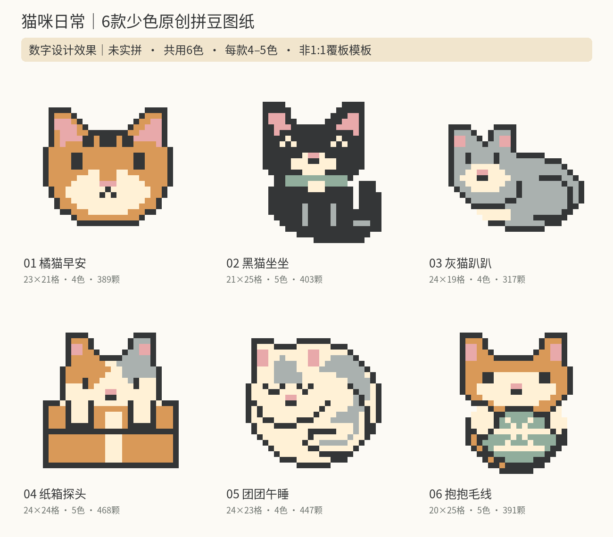

# 轻用资料库

这里收录两套原创免费资料：多人出游 AA 记账模板与「猫咪日常」拼豆图纸。内容由 AI 辅助设计、编写与整理，验证范围见下方说明。

## 1. 多人出游 AA 记账模板

适合 2–8 人、最多 100 笔费用，按每笔实际参与者均分。含成员设置、费用明细、结算汇总与三人示例，可查看每人的已付款、应分摊、应收与应付。

优先领取：[百度网盘免费领取](https://pan.baidu.com/s/1ElBwl08ozgw3-1pB2Vb38g?pwd=36sw)，提取码：36sw。

GitHub 备用下载：

- [下载记账模板（XLSX）](aa-travel.xlsx)
- [查看使用说明（PDF）](aa-guide.pdf)

已完成 13 项公式测试；尚未在原生 Excel、WPS 的全部版本中实测。使用前请先读说明，结算前共同核对收据、输入与汇总。

模板使用单一币种，不自动换汇，不处理负数退款或按比例分摊，不自动安排转账对象或执行转账。

## 2. 猫咪日常：6 款少色原创拼豆图纸

包含橘猫早安、黑猫坐坐、灰猫趴趴、纸箱探头、团团午睡、抱抱毛线。每款 4–5 色，图案范围均不超过 29×29 格。

优先领取：[百度网盘免费领取](https://pan.baidu.com/s/1a9SNz8v2S051f3jzYlYYsQ?pwd=accu)，提取码：accu。

GitHub 备用下载：

- [查看图纸册（PDF，8 页）](cat-patterns.pdf)
- [下载完整包（ZIP，含 PDF、高清 PNG 与 CSV）](cat-patterns.zip)
- [查看数字设计预览（PNG）](cat-preview.png)

已校验图例、颜色、颗数与珠位连通性；尚未实拼验证。上图是数字设计预览，不能代表实物效果或熨烫后的牢固度。

配色是屏幕参考色，不是品牌色号；图纸用于对照数格，不是通用 1:1 覆板图。请自行匹配珠子与插板规格，先少量试拼，并遵循材料和工具厂商的熨烫说明。这是一套成人手作平面装饰图案，不作为杯垫或承重挂件；热熨斗和小珠应远离儿童。

## 免费取用与自愿支持

以上资料均可免费取用，无需付费支持即可下载。

如果这些资料对你有帮助，也可以通过[轻用资料库的爱发电主页](https://afdian.com/a/qingyongziliaoku)自愿支持。支持不提供额外资料、定制服务或其他回馈。

